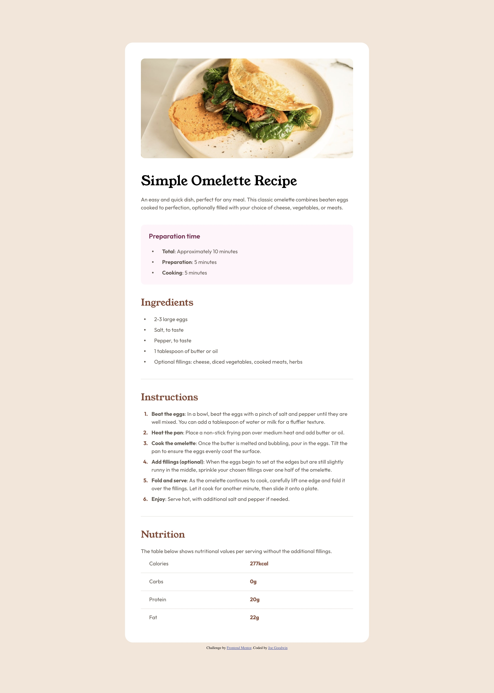

# Frontend Mentor - Recipe page solution

This is a solution to the [Recipe page challenge on Frontend Mentor](https://www.frontendmentor.io/challenges/recipe-page-KiTsR8QQKm). Frontend Mentor challenges help you improve your coding skills by building realistic projects.

## Table of contents

- [Overview](#overview)
  - [The challenge](#the-challenge)
  - [Screenshot](#screenshot)
  - [Links](#links)
- [My process](#my-process)
  - [Built with](#built-with)
  - [What I learned](#what-i-learned)
- [Author](#author)

## Overview

### The challenge

Your challenge is to build out this recipe page and get it looking as close to the design as possible.

You can use any tools you like to help you complete the challenge. So if you've got something you'd like to practice, feel free to give it a go.

### Screenshot

### Links

- Solution URL: [Github](https://github.com/jcgoodwin86/frontend-mentor-recipe-page)
- Live Site URL: [Live](https://brilliant-yeot-f0c1ab.netlify.app/)

## My process

### Built with

- Semantic HTML5 markup
- CSS custom properties
- Flexbox
- CSS Grid
- Mobile-first workflow

### What I learned

When trying to style `<ul>` and `<ol>,` I learned that it sets the display to list-style. I was using Flexbox, and the bullets of the list would disappear.

## Author

- Website - [Joe Goodwin](https://www.jcgoodwin.com)
- Frontend Mentor - [@jcgoodwin86](https://www.frontendmentor.io/profile/jcgoodwin86)
